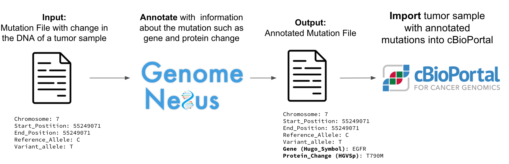

# Improving Genome Nexus' Command Line Interface Experience - GSoC 2022 Final Work Submission  

## Overview  

[Genome Nexus](https://www.genomenexus.org/) [^1] is a command line tool for the annotation and interpretation of mutations in cancer. cBioPortal leverages Genome Nexus' API to show how a mutation might change the protein or how often a mutation occurs in healthy populations or patients with cancer. The workflow of how Genome Nexus related to cBioPortal is shown below:

## Goals  

Currently, there a variety of different tools to help with this including
* [genome-nexus-annotation-pipeline](https://github.com/genome-nexus/genome-nexus-annotation-pipeline) for annotation of MAF files,
* [annotation-tools](https://github.com/genome-nexus/annotation-tools) for annotation of VCF files and
* [genome-nexus-cli](https://github.com/genome-nexus/genome-nexus-cli) with a redesigned interface for both.

The first goal is to improve the command line experience of Genome Nexus by unifying the current 3 tools into a single recommended command line interface and the second goal is to develop public documentation on how to best annotate a mutation file in MAF and VCF leveraging the new unified interface.

## Approved Activities  

Here is the list of approved activities such as pull requests and their respective commits:

### 1. Goal #1 'Unify existing tools' related activities:  

* Add subcommands annotate and merge [#201](https://github.com/genome-nexus/genome-nexus-annotation-pipeline/issues/201), [#204](https://github.com/genome-nexus/genome-nexus-annotation-pipeline/pull/204), [71116e7](https://github.com/genome-nexus/genome-nexus-annotation-pipeline/commit/71116e7496c1c07098fbcb8796397633342a2a98)

### 2. Goal #2 'Improve documentation' related activities:  

* Improve documentation [#215](https://github.com/genome-nexus/genome-nexus-annotation-pipeline/issues/215), [#219](https://github.com/genome-nexus/genome-nexus-annotation-pipeline/pull/219), [d51a557](https://github.com/genome-nexus/genome-nexus-annotation-pipeline/commit/d51a5576d2cc050c07ea8be466e4336223e6e26e)
* Click [**here**](https://github.com/genome-nexus/genome-nexus-annotation-pipeline/blob/master/CMD_HELP.md) for the documentation page.

### 3. Additional activities:  

* **Feature**: the option named **output-format**  
Respective pull requests and issues: [#210](https://github.com/genome-nexus/genome-nexus-annotation-pipeline/issues/210), [#198](https://github.com/genome-nexus/genome-nexus-annotation-pipeline/pull/198), [#213](https://github.com/genome-nexus/genome-nexus-annotation-pipeline/pull/213), [#194](https://github.com/genome-nexus/genome-nexus-annotation-pipeline/issues/194)
  * Add output-format as option and its functionality with an example file [5f30f5b](https://github.com/genome-nexus/genome-nexus-annotation-pipeline/commit/5f30f5b07e803d4f46cac5f4e58b0b76987d18e1)
  * Add output format tcga [b79f777](https://github.com/genome-nexus/genome-nexus-annotation-pipeline/commit/b79f777f672a75af7a566498f1f2b9bdf7187194)
  * Add output format minimal [52d9d77](https://github.com/genome-nexus/genome-nexus-annotation-pipeline/commit/52d9d7760cf314c35e07c7cb41358983db8e35f9)
  * Add tests for minimal and tcga output formats [#213](https://github.com/genome-nexus/genome-nexus-annotation-pipeline/pull/213), [5737506](https://github.com/genome-nexus/genome-nexus-annotation-pipeline/commit/573750651d64d3b624946fa3d43db195d5fd0077)
  * Add tests for custom output format [#213](https://github.com/genome-nexus/genome-nexus-annotation-pipeline/pull/213), [50798b1](https://github.com/genome-nexus/genome-nexus-annotation-pipeline/commit/50798b16d0ca2a12a7c96a4e2f0f142b265e2708)
  * Rename tcga to extended [#220](https://github.com/genome-nexus/genome-nexus-annotation-pipeline/pull/220), [3965d15](https://github.com/genome-nexus/genome-nexus-annotation-pipeline/commit/3965d1513b6cb1dffe303e242b0af6ec9b6982b4)
  * Fix custom file formatting [#222](https://github.com/genome-nexus/genome-nexus-annotation-pipeline/pull/222), [98115a0](https://github.com/genome-nexus/genome-nexus-annotation-pipeline/commit/98115a0153873e4a9d85e7e45130bd3092caf174)

  
* **Feature**: Additional runtime metrics  
  * Add runtime metrics [#221](https://github.com/genome-nexus/genome-nexus-annotation-pipeline/pull/221), [50953cd](https://github.com/genome-nexus/genome-nexus-annotation-pipeline/commit/50953cdd6326490bb82d4e031ce1ce9604526314)

* **Feature**: Input validation  
  * Add MAF file validation [#203](https://github.com/genome-nexus/genome-nexus-annotation-pipeline/issues/203), [#196](https://github.com/genome-nexus/genome-nexus-annotation-pipeline/pull/196), [f446339](https://github.com/genome-nexus/genome-nexus-annotation-pipeline/commit/f446339a67f67cb8667914b62225d48d461ebf7a)

* **Improvement:** Unit tests, integration tests    
Total amount of tests increased from 16 to 68. Respective issues: [#202](https://github.com/genome-nexus/genome-nexus-annotation-pipeline/issues/202) 
  * Add tests for MutationRecordProcessor [#207](https://github.com/genome-nexus/genome-nexus-annotation-pipeline/pull/207), [e2e8c65](https://github.com/genome-nexus/genome-nexus-annotation-pipeline/commit/e2e8c655fd0203ca34a92540d37e7fe407e3196c), [c3b1574](https://github.com/genome-nexus/genome-nexus-annotation-pipeline/commit/c3b15741889b24db71bed12545921c7f0decaf5b)
  * Convert config.yml to unit tests [#200](https://github.com/genome-nexus/genome-nexus-annotation-pipeline/pull/200), [ab7b1b0](https://github.com/genome-nexus/genome-nexus-annotation-pipeline/commit/ab7b1b0f96c4e1d1c388772f5c0355b18f3020be), [1a5dd65](https://github.com/genome-nexus/genome-nexus-annotation-pipeline/commit/1a5dd658db4c059d5ba4dca8815e083d6e0d4a23)
  * Remove converted tests from config.yml [#200](https://github.com/genome-nexus/genome-nexus-annotation-pipeline/pull/200), [71b2d50](https://github.com/genome-nexus/genome-nexus-annotation-pipeline/commit/71b2d508ba441c3a048a0c4cbd09723d35478dea)
  * Delete old batch test [#200](https://github.com/genome-nexus/genome-nexus-annotation-pipeline/pull/200), [0f857ec](https://github.com/genome-nexus/genome-nexus-annotation-pipeline/commit/0f857ec2564f67c41608b2977f74e811605417ae)

* **Improvement:** Replace lo4j with slf4j
  * Replace log4j imports with slf4j [#199](https://github.com/genome-nexus/genome-nexus-annotation-pipeline/pull/199), [3bf2844](https://github.com/genome-nexus/genome-nexus-annotation-pipeline/commit/3bf284469dea1ec2d1d63b66eab5309994d35c8e)
  * Replace apache.lo4j with slf4j [#208](https://github.com/genome-nexus/genome-nexus-annotation-pipeline/pull/208), [44288aa](https://github.com/genome-nexus/genome-nexus-annotation-pipeline/commit/44288aa014deced50c3704ac98bfd2b58e5ae1ef), [c302523](https://github.com/genome-nexus/genome-nexus-annotation-pipeline/commit/c302523f41d34c6fb9ab66b5bcf213f012ebecde) 

* **Additional Improvements**
  * Use post method as default [#214](https://github.com/genome-nexus/genome-nexus-annotation-pipeline/pull/214), [5d24b3f](https://github.com/genome-nexus/genome-nexus-annotation-pipeline/commit/5d24b3f1250c1a83ff3d3370b0fb5eebee4177b0)
  * Remove unwanted logs while file loading [#193](https://github.com/genome-nexus/genome-nexus-annotation-pipeline/issues/193), [#195](https://github.com/genome-nexus/genome-nexus-annotation-pipeline/pull/195), [44288aa](https://github.com/genome-nexus/genome-nexus-annotation-pipeline/commit/44288aa014deced50c3704ac98bfd2b58e5ae1ef), [8bad1bf](https://github.com/genome-nexus/genome-nexus-annotation-pipeline/commit/8bad1bf90f64f4c9380c2e1849390559bec18213)
  * Fix redundant exception prints [#217](https://github.com/genome-nexus/genome-nexus-annotation-pipeline/pull/217), [0e7a1f3](https://github.com/genome-nexus/genome-nexus-annotation-pipeline/commit/0e7a1f34c77cad02faf003e80a29832a15985cca)

* **Fixes**
  * Address Rmadupuri test errors [#223](https://github.com/genome-nexus/genome-nexus-annotation-pipeline/issues/223), [#224](https://github.com/genome-nexus/genome-nexus-annotation-pipeline/pull/224), [0a95018](https://github.com/genome-nexus/genome-nexus-annotation-pipeline/commit/0a950182fba7a916b810faeb788db242c38e23fc)

## Coming Features  
* Performance improvements
  * The tool uses too much memory, and it takes too long to annotate a MAF file that includes more than a million records.
    * Runtime-wise problem is solved [#227](https://github.com/genome-nexus/genome-nexus-annotation-pipeline/pull/227), [788e04c](https://github.com/genome-nexus/genome-nexus-annotation-pipeline/pull/227/commits/788e04cc7569f719ed103561d80308dd5ce622f6)
      * ~50% performance increase
      * Additional experimental branch that addresses related issues [#226](https://github.com/genome-nexus/genome-nexus-annotation-pipeline/pull/226)
        * As a bonus, with the new data presentation layer coming with this feature, the removal of empty columns is straightforward
    * Memory-wise problem is addressed [#216#issuecomment-1241965326](https://github.com/genome-nexus/genome-nexus-annotation-pipeline/issues/216#issuecomment-1241965326)
* The option named **split-output** [#209](https://github.com/genome-nexus/genome-nexus-annotation-pipeline/pull/209), [feaee5a](https://github.com/genome-nexus/genome-nexus-annotation-pipeline/pull/209/commits/feaee5a39249b7f1c93ec92cbe614e866a3a7e8d) 
  * This option produces two additional files based on the value of annotation status of a variant. 
* Fix the metric total runtime [#228](https://github.com/genome-nexus/genome-nexus-annotation-pipeline/pull/228), [c873281](https://github.com/genome-nexus/genome-nexus-annotation-pipeline/pull/228/commits/c873281c15a369dbc5ee9e9bfe51c4eada954513)

## Future  
* The runtime of the application should be improved further by sending multiple requests at a time as much as possible.  
* The need for Spring Batch Framework should be reconsidered.  
  * As an example, after profiling, I saw that the main bottlenecks of the application are caused by misconfiguration of the chunk size and the metadata production for persistence. Both are features of Spring Batch that the application doesn’t need. And additionally, the application isn't using multiple jobs and multiple steps either.  
* More tests and assertions won’t hurt.  
* Using a test coverage service like Coveralls might be a good addition to the established CircleCI pipeline.
* A universal code formatting should be decided and forced

## Closing  

This open source project is the first project that I contributed besides the ones that I self-published. It was a pleasure to contribute.  

Working in a multicultural team with teammates in different timezones sounds like it should be a challenge but when you and your teammates have the correct mindset, tools, and pipelines built on these tools, it is a joy. 

I would like to thank Google and the people organise GSoC.  
I would also like to thank my mentors and my teammates: (Jag) Prasanna K Jagannathan, [Ino de Bruijn](http://ino.pm/), [Ramya Madupuri](https://www.linkedin.com/in/ramyasree-madupuri/)

[^1]: de Bruijn I, Li X, Sumer SO, et al. Genome Nexus: A Comprehensive Resource for the Annotation and Interpretation of Genomic Variants in Cancer. JCO Clin Cancer Inform. 2022;6:e2100144. doi:10.1200/CCI.21.00144

